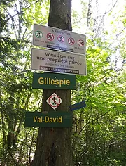
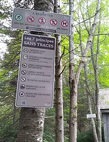

 

Depuis deux ans, les réseaux de plein air sont fortement fréquentés. De nouveaux adeptes de plein air utilisent les sentiers et il est devenu important d’améliorer l’affichage sur les sentiers afin de les sensibiliser aux répercussions de leurs pratiques de plein air en milieu naturel. Vous remarquerez les nouvelles affiches sur nos sentiers.

Merci à Loisirs Laurentides de nous avoir fourni ces affiches.

